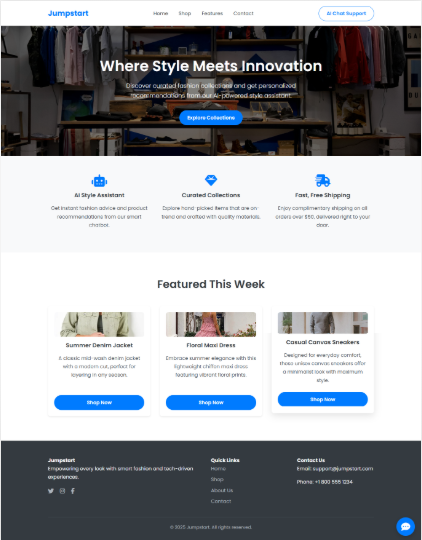
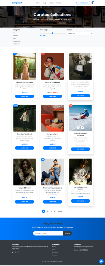

# FAQ Chatbot Project 🤖

  
*Image of the AI-powered FAQ Chatbot Landing Page*

  
*Image of the Shopping Page*

## Project Description
Jumpstart, a nationwide fashion retailer with 750 stores and a growing e-commerce platform, faces increasing challenges in handling high volumes of customer queries. To enhance operational efficiency and customer experience, Aceadora Tech proposes an **Automated Customer Support system using AI chatbots**. The system provides instant, accurate, and consistent responses to FAQs and resolves customer queries efficiently.

## Project Overview
The AI-powered chatbot integrates with Jumpstart’s online platforms, including the website, mobile app, and social media channels. Using **Natural Language Processing (NLP)** and **Machine Learning**, the chatbot understands customer queries and continuously improves responses over time. It operates 24/7 while ensuring **data privacy**, **transparency**, and adherence to **ethical AI standards**.

## Key Features
- **24/7 Customer Support**: Provides instant assistance at any time.  
- **FAQ Handling**: Answers common questions about products, shipping, returns, and promotions.  
- **Query Resolution**: Assists with order tracking, account management, and payment issues.  

## Installation & Setup
1. Clone the repository:  
   ```bash
   git clone https://github.com/Icyln/faq-chatbot.git
